# Mario's Picross GB Disassembly: Game Flow Reference

Based on currently mapped symbols in `Mario's Picross (USA, Europe) (SGB Enhanced).sym` and `disassembly/bank_00[1-f].asm`. Only mapped symbols and directly observed control flow are included.

## 1) Main Game Loop & Interrupts

At a high level, runtime is frame-driven: game logic advances in a repeating loop, while
interrupt-time work coordinates display-safe updates and frame pacing. The active game
state/phase variables select which handler runs each frame, and those handlers update
input-driven state, timers, puzzle/menu logic, and queued rendering/audio requests.

Mapped RAM labels indicate a standard split between mainline state progression and
interrupt-coordinated synchronization:

- Mainline state context is tracked through bytes such as `rGameState_Current` and
	`rStatePhase_Current`.
- Frame synchronization is tracked via `rVBlankSyncFlag`, `rVBlankFrameCounter`, and
	`rLCDCFrameTickCounter`.
- Buffered rendering writes use shadow state (for example `rShadowOAMWriteCursor`) that
	is consumed/applied during safe timing windows.
- Audio update cadence is integrated with the frame cycle through the sound dispatcher and
	per-frame update routine, with LCDC-assisted scheduling controlled by
	`rUseLCDCInterruptForSoundEngineUpdateFlag`.

### VBlank interrupt

Broadly, the VBlank interrupt acts as the frame boundary and safe transfer window. Based on
mapped symbols and observed call structure, its responsibilities include:

- Advancing frame-sync flags/counters used by the main loop wait-and-step pattern.
- Applying buffered video-facing state (for example OAM/palette/register shadow values)
	during VBlank-safe timing.
- Coordinating per-frame audio timing with the sound engine update path.
- Supporting SGB/LCDC timing-sensitive operations when those flows are active.

## 2) State Flow

The game is driven by a state machine centered on the main game-state byte, with state handlers dispatched from the startup/runtime entry points and phase-specific routines reached from within each state. The flow starts from the title and selection screens, moves into gameplay, and then branches into result/end-game paths depending on the mode and outcome. The available evidence supports a layered structure of broad states plus smaller phase steps, rather than a single monolithic loop.

### GameState Flow

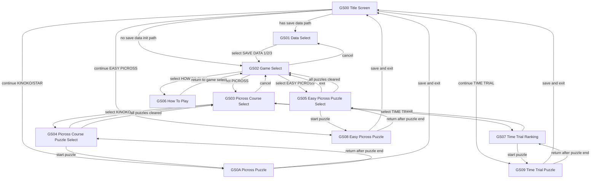

### Phase Flows

#### GS00 Phase Flow

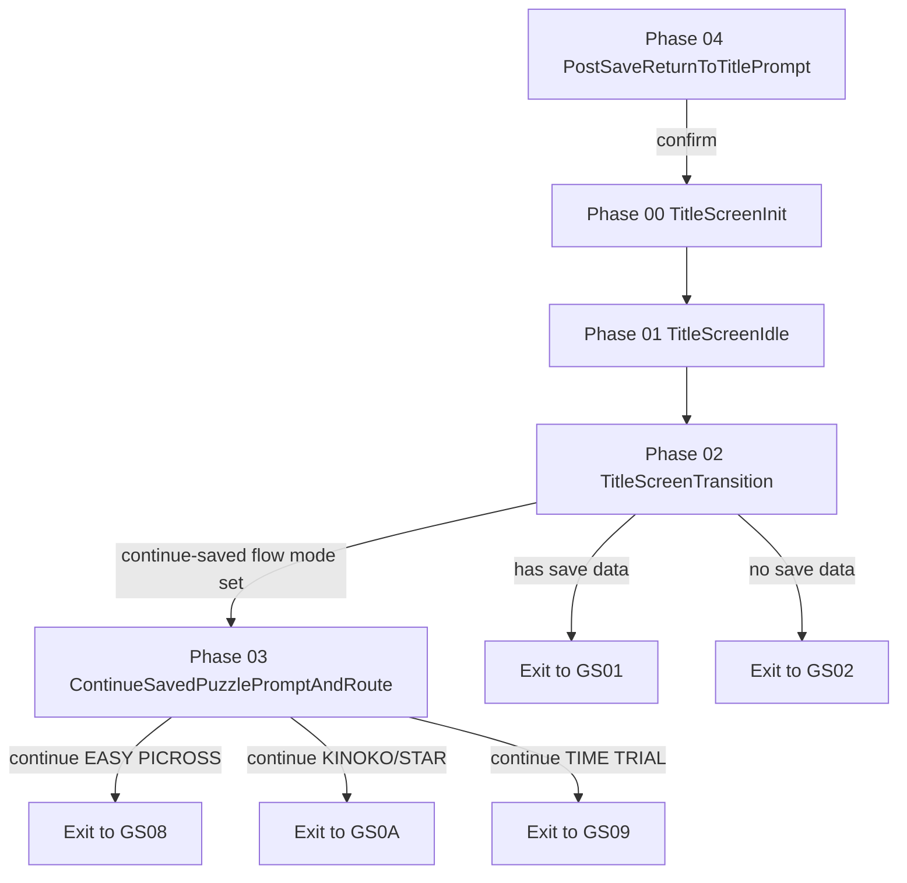

#### GS01 Phase Flow

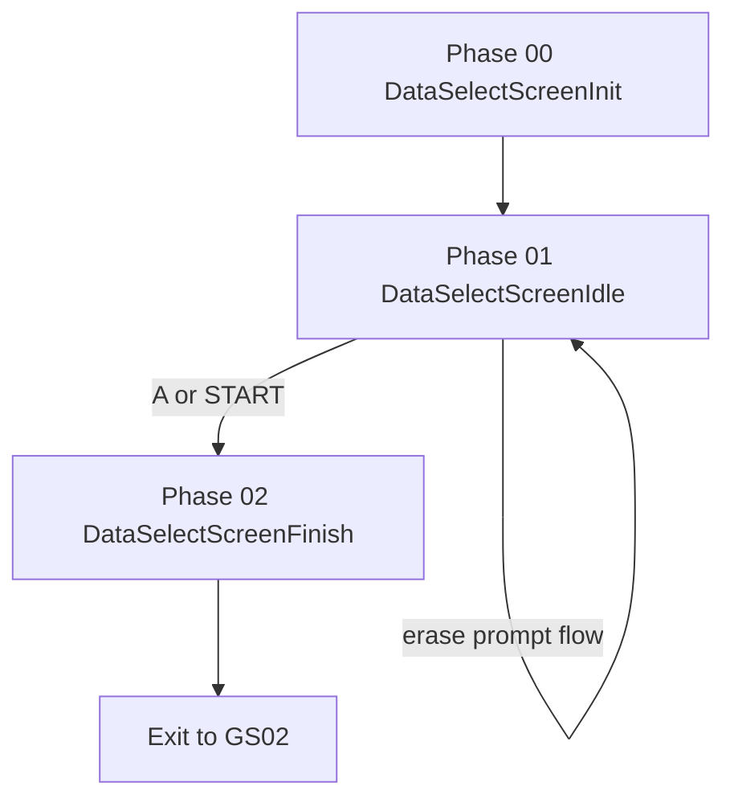

#### GS02 Phase Flow

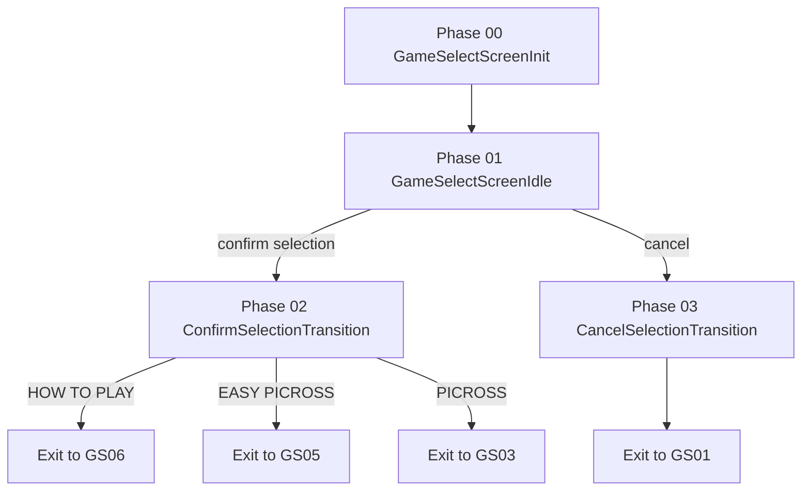

#### GS03 Phase Flow

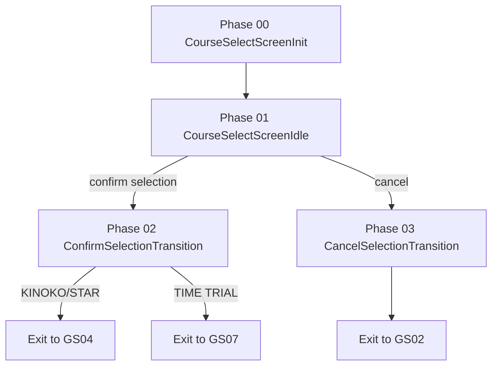

#### GS04 Phase Flow

#### GS05 Phase Flow

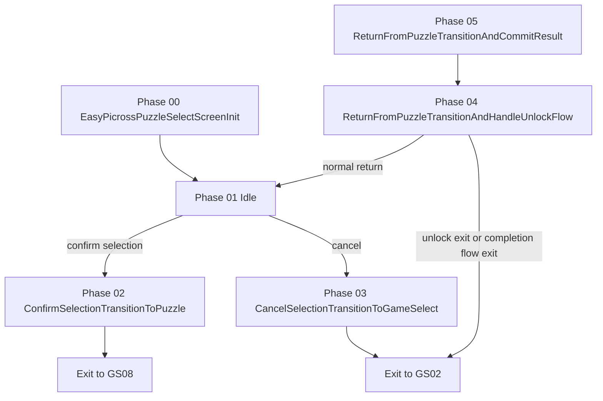

#### GS06 Phase Flow

```mermaid
flowchart TD
	GS06P00[00 Init] --> GS06P01[01 Message]
	GS06P01 --> GS06P02[02 HighlightNumbersTop Prepare]
	GS06P02 --> GS06P03[03 HighlightNumbersTop Animation]
	GS06P03 --> GS06P04[04 HighlightNumbersLeft Prepare]
	GS06P04 --> GS06P05[05 HighlightNumbersLeft Animation]
	GS06P05 --> GS06P06[06 Message]
	GS06P06 --> GS06P07[07 Message]
	GS06P07 --> GS06P08[08 SolvePuzzle Prepare]
	GS06P08 --> GS06P09[09 SolvePuzzle Animation]
	GS06P09 --> GS06P0A[0A SolvePuzzle Finish]
	GS06P0A --> GS06P0B[0B Message]
	GS06P0B --> GS06P0C[0C ResetBoard]
	GS06P0C --> GS06P0D[0D HighlightNumbersTop Prepare]
	GS06P0D --> GS06P0E[0E HighlightNumbersTop Animation]
	GS06P0E --> GS06P0F[0F Message]
	GS06P0F --> GS06P10[10 HighlightNumbersFirstColumn Prepare]
	GS06P10 --> GS06P11[11 HighlightNumbersFirstColumn Animation]
	GS06P11 --> GS06P12[12 SolveFirstColumn Prepare]
	GS06P12 --> GS06P13[13 SolveFirstColumn Animation]
	GS06P13 --> GS06P14[14 HighlightNumbersLeft Prepare]
	GS06P14 --> GS06P15[15 HighlightNumbersLeft Animation]
	GS06P15 --> GS06P16[16 Message]
	GS06P16 --> GS06P17[17 HighlightNumbersSecondRow Prepare]
	GS06P17 --> GS06P18[18 HighlightNumbersSecondRow Animation]
	GS06P18 --> GS06P19[19 SolveSecondRow Prepare]
	GS06P19 --> GS06P1A[1A SolveSecondRow Animation]
	GS06P1A --> GS06P1B[1B Message]
	GS06P1B --> GS06P1C[1C DecrementPuzzleTimer]
	GS06P1C --> GS06P1D[1D GameOverMessage]
	GS06P1D --> GS06P1E[1E MakeMistake Prepare]
	GS06P1E --> GS06P1F[1F MakeMistake Animation]
	GS06P1F --> GS06P20[20 Message]
	GS06P20 --> GS06P21[21 MarkWithX Prepare]
	GS06P21 --> GS06P22[22 MarkWithX Animation]
	GS06P22 --> GS06P23[23 WithHintPopUp Prepare]
	GS06P23 --> GS06P24[24 WithHintPopUp Demonstration]
	GS06P24 --> GS06P25[25 Message]
	GS06P25 --> GS06P26[26 StopTopHintCursor]
	GS06P26 --> GS06P27[27 StopLeftHintCursor]
	GS06P27 --> GS06P28[28 ApplyHintSolve]
	GS06P28 --> GS06P29[29 AdvanceOrRestart]
	GS06P29 -->|restart path| GS06P00
	GS06P29 -->|cancel path| GS06P2A[2A CancelAndReturnToMenu]
```

#### GS07 Phase Flow

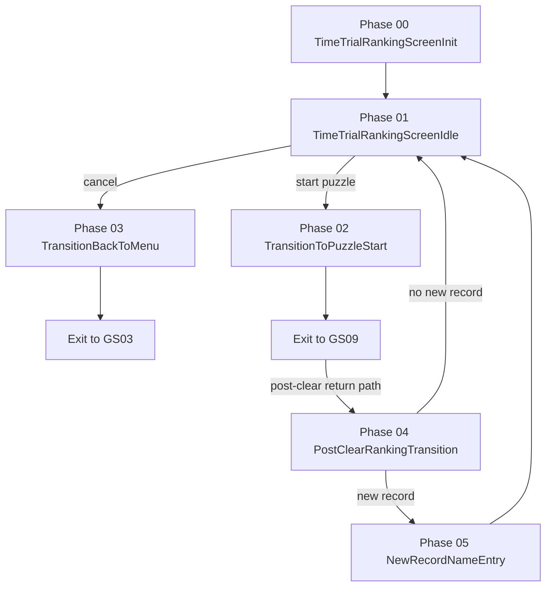

#### GS08 Phase Flow

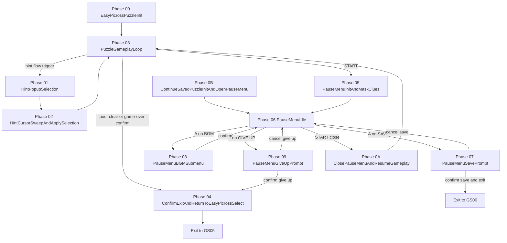

#### GS09 Phase Flow

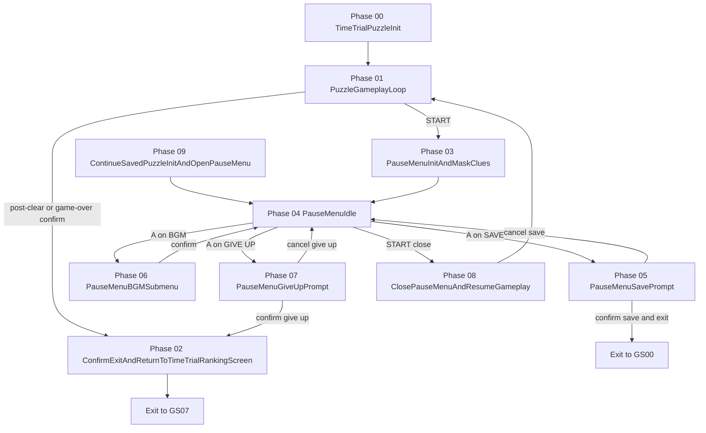

#### GS0A Phase Flow

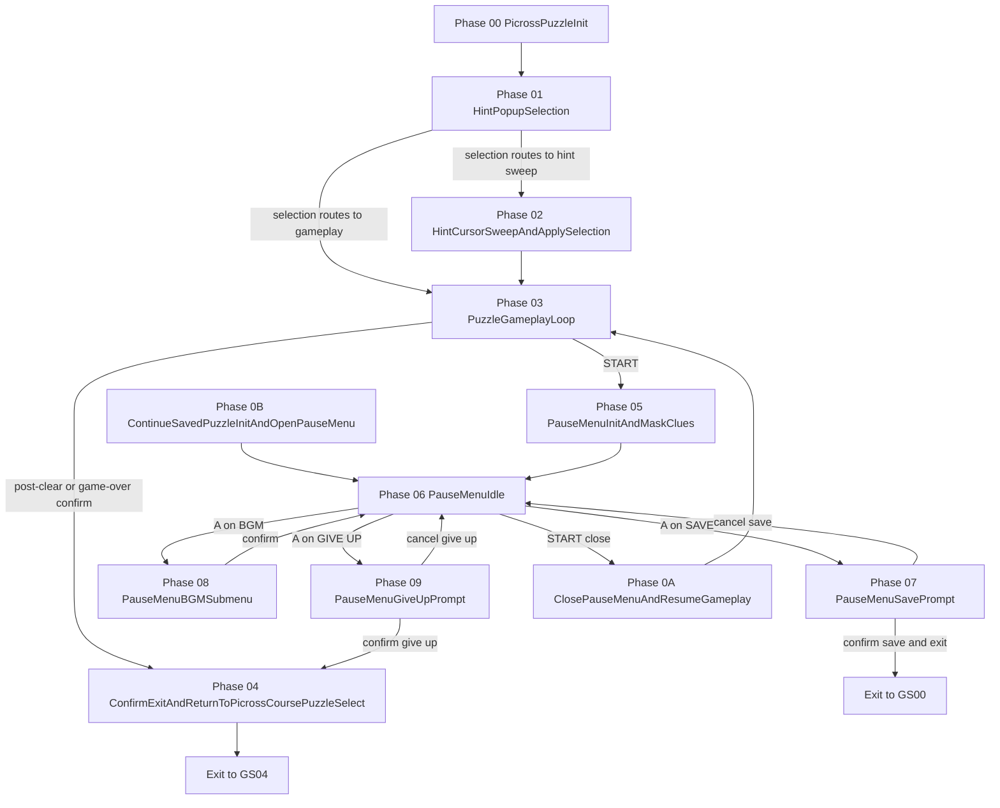

## 3) Graphics & Sprite Rendering System

### CopyOAMSpriteById

`CopyOAMSpriteById` (`00:20ce`) is a shared sprite blit helper used widely by UI and gameplay code. It takes a sprite ID in `A`, uses that ID to look up a pointer in a bank-03 sprite pointer table (`03:6c63`), then copies one or more 4-byte OAM entries into shadow OAM at `c000 + rShadowOAMWriteCursor`. For each entry, it applies the call-site position offsets (`B` added to X, `C` added to Y), writes tile/attribute bytes unchanged, stops on `$ff`, and finally stores the updated shadow OAM cursor.

## 4) Sound Engine (Bank 0f core)

The mapped sound driver is centered in bank 0f and exposed through two call points in bank 00:

- `CallSoundCommandDispatcher` (`00:03b6`) forwards command ID + parameter into bank 0f dispatcher logic.
- `CallSoundEngineUpdateRoutine` (`00:03ee`) runs the per-frame audio update routine.

At bank 0f entry:

- `Jumpvector_SoundCommandDispatcher` (`0f:4000`) -> `SoundCommandDispatcher`.
- `Jumpvector_SoundEngineUpdateRoutine` (`0f:4003`) -> `SoundEngine_FrameTickRoutine`.

### Runtime model

1. Game logic calls the dispatcher with command byte in `A` and parameter in `C`.
2. The dispatcher routes command IDs through `SoundCommandDispatcher_Cmd00To07PointerTable` (`0f:4080`) to top-level Cmd handlers.
3. `Cmd01`/`Cmd02` load a 4-pointer row (voice 1..4 command streams) and update the active-voice mask.
4. `SoundEngine_FrameTickRoutine` iterates active voices each frame.
5. For each voice, `SoundEngine_ProcessVoiceTick` either:
- consumes a new commandstream byte sequence when countdown reaches zero, or
- advances runtime counters and applies staged NRxx writes.

### Commandstream format

- `F0`-`FF`: F-group opcode dispatch via `SoundEngine_FOpcodeDispatchPointerTable` (`0f:40b0`).
- `E0`-`EF`: E-group opcode dispatch via `SoundEngine_EOpcodeDispatchPointerTable` (`0f:4090`).
- Other bytes: timed event bytes handled by voice-data path.

F-group payload widths (bytes consumed after the opcode):

- `0-byte`: `F2`, `F3`, `F8`, `FD`, `FF`
- `1-byte`: `F1`, `F4`, `F6`, `F7`, `F9`, `FA`, `FB`, `FC`
- `2-byte`: `F0`, `FE`
- `3-byte`: `F5`

Timed event byte behavior:

- Low nibble selects base duration index from `SoundEngine_NoteLengthTickTable`.
- Consecutive `Cx` bytes extend/accumulate duration in the same event chain.
- High nibble contributes the per-event pitch/control selection; `Dx` takes the special rest/sentinel path in the data decoder.

### Control-flow opcodes used by streams

- `EE`: jump to inline 16-bit pointer (unconditional branch), handled by `SoundEngine_OpEE_Cmd16_JumpToInlinePointer`.
- `FE`: call inline 16-bit pointer (pushes return context), handled by `SoundEngine_OpFE_Cmd26_CallInlinePointer`.
- `EF`: return from `FE` subroutine; if no return context exists, deactivate/stop voice, handled by `SoundEngine_OpEF_Cmd17_ReturnOrStopVoice`.
- `F1` / `F2`: counted loop start/end pair (`SoundEngine_OpF1_Cmd19_SetLoopCounterAndBranchPointer` / `SoundEngine_OpF2_Cmd1A_DecrementLoopCounterAndBranch`).

### Setup opcodes seen at stream heads

- `F0`: timbre/trigger payload setup (`SoundEngine_OpF0_SetTimbreAndTrigger`).
- `F4`: pitch-base low-byte setup (`SoundEngine_OpF4_SetPitchBaseLowByte`).
- `F5`: pitch-offset gate/step payload setup (`SoundEngine_OpF5_SetPitchOffsetGateAndStep`).
- `F6`: pitch-base high-byte setup (`SoundEngine_OpF6_SetPitchBaseHighByte`).
- `F7`: volume setup (`SoundEngine_OpF7_SetVoiceVolumeFromNibble`).
- `F9`: phase accumulator setup (`SoundEngine_OpF9_SetPhaseAccumulatorByte`).
- `FA`: voice-rate setup (`SoundEngine_OpFA_SetVoiceRateFromPackedNibbles`).
- `FB`: stereo panning setup (`SoundEngine_OpFB_SetVoicePanningByte`).
- `FC`: frequency low-byte setup (`SoundEngine_OpFC_SetFrequencyLowByte`).
- `FD`: shared advance/continue opcode (`SoundEngine_OpEB_EC_F3_F8_FD_FF_Consume1ByteAndContinue`).
- `E0`-`E8`: set voice-control low nibble to immediate opcode nibble (`SoundEngine_OpE0ToE8_SetVoiceControlLowNibble`).
- `E9`: increment voice-control low nibble up to `08` (`SoundEngine_OpE9_IncrementVoiceControlLowNibbleTo08`).
- `EA`: decrement voice-control low nibble down to `00` (`SoundEngine_OpEA_DecrementVoiceControlLowNibbleTo00`).
- `ED`: group attenuation setup from opcode low nibble (`SoundEngine_OpED_SetGroupAttenuationFromNibble`).

## 5) Save-Slot RAM Region Structure

The save-related region is centered in the `a000`-`ba07` address space and is split into a primary block plus a mirrored copy with checksums.

| Address / Range | Size | Key symbols | Purpose |
|---|---:|---|---|
| a000 | 1 | rSaveDataPrimaryBlockStart | Start of primary save-data block. |
| a001-a002 | 2 | rPuzzleOrderTableCursor, rPuzzleOrderTableStart | Puzzle-order table cursor + start pointer label. |
| a003-a03e | 0x3c | rPuzzleOrderTableStart (continuation) | Interior bytes of the 64-byte puzzle-order table (initialized/shuffled from bank 02 at 02:5267/02:5274). |
| a03f | 1 | rSaveDataTimeTrialRankingEntriesInsertAddressBias | Address-bias anchor used by GS07 name-entry commit address math (`base + 7 * rankPos`); this is an anchor constant, not a separately updated gameplay field. |
| a042-a064 | 0x23 | rSaveDataTimeTrialRankingEntries, rSaveDataTimeTrialRankingEntriesShiftSourceEnd, rSaveDataTimeTrialRankingEntriesShiftDestEnd | Time Trial ranking table in save data (5 entries x 7 bytes: MMSS + 3-char name), plus helper endpoints used by ranking-entry shifting. |
| a065 | 1 | rSelectedSaveSlotIndex | Active save-slot index used by GS01/GS04/GS05 logic. |
| a066-a068 | 3 | rSaveSlotXPuzzleActionRuleIndex_Unused | Per-slot puzzle action rule bytes used by puzzle-action routing logic; appears unused in normal gameplay flow (0/1 allow routing, >=2 blocks cell-action handling). |
| a069-a077 | 0x0f | rSaveSlotXEasyPicrossBGMSelectionIndex, rSaveSlotXPicrossKinokoBGMSelectionIndex, rSaveSlotXPicrossStarBGMSelectionIndex, rSaveSlotXTimeTrialBGMSelectionIndex, rSaveSlotXModeBGMSelectionIndexEntry4_Unknown | Per-slot BGM selection index entries (5 bytes per save slot: Easy Picross, Picross Kinoko, Picross Star, Time Trial, unknown entry4). |
| a078-a07a | 3 | rSaveSlotXGameSelectCursorRow | Per-slot game-select cursor row. |
| a07b-a07d | 3 | rSaveSlotXEasyPicrossPostClearUnlockHandledFlag | Per-slot Easy Picross post-clear unlock-handled flags (observed in GS05 return/unlock flow). |
| a07e-a080 | 3 | rSaveSlotXEasyPicrossClearedPuzzleCount | Per-slot Easy Picross cleared-count values. |
| a081-a086 | 6 | rSaveSlotXEasyPicrossPuzzleSelectCursorColumn/Row | Per-slot Easy Picross puzzle-select cursor positions. |
| a087-a386 | 0x300 | rSaveSlotXEasyPicrossPuzzleTimeDataRecordTable | Easy Picross per-slot time records (3 slots, each 64 entries x 3 bytes). |
| a387-a389 | 3 | rSaveSlotXUnlockProgressState | Per-slot unlock progression state (`$01/$02/$03` observed). |
| a38a-a38c | 3 | rSaveSlotXPicrossKinokoStarClearedPuzzleCount | Per-slot shared cleared-count used for GS04 unlock checks. |
| a38d-a38f | 3 | rSaveSlotXCourseSelectCursorRow | Per-slot GS04 course-select row. |
| a390-a3a1 | 0x12 | rSaveSlotXPicross{Course}PuzzleSelectCursorColumn/Row | Per-slot + per-course GS04 cursor caches (Kinoko, Star, TimeTrial). |
| a3a2-aa61 | 0x6c0 | rSaveSlotXPicross{Course}PuzzleTimeDataRecordTable | GS04 time tables (3 slots x 3 course rows x 64 entries x 3 bytes). |
| aa62-aca1 | 0x240 | rSaveSlotXPicross{Course}PuzzleStatusDataTable | GS04 status tables (3 slots x 3 course rows x 64 entries x 1 byte). |
| aca2 | 1 | rContinueSavedPuzzlePromptRouteMode | Continue-saved prompt route mode byte used to choose the resume destination path. |
| aca3-acea | 0x48 | rSavedPuzzleHintPopupSelection, rSavedPuzzleTimerPenaltyStep, rSavedPuzzleTimerMinuteOnes, rSavedPuzzleTimerMinuteTens, rSavedPuzzleTimerSecondOnes, rSavedPuzzleTimerSecondTens, rSavedPuzzleDataIndexLow, rSavedPuzzleDataIndexHigh, rSavedPuzzleCursorColumn, rSavedPuzzleCursorRow, rSavedPuzzleCellStatePackedBuffer, rSavedPuzzleGridWidth, rSavedPuzzleGridHeight | Saved puzzle snapshot fields used by continue/restore flow (timer, puzzle id, cursor, packed cell-state buffer, grid dimensions). |
| aceb-acec | 2 | (unmapped) | No direct read/write path is currently mapped for these two bytes; they sit between the saved-puzzle snapshot end (`acea`) and the hidden-signature mirror start (`aced`), and are still persisted/validated as part of the full save block checksum/mirror flow. |
| aced | 1 | rHiddenProgrammerCreditsMirror | Mirror byte tied to signature validation data. |
| acee-acfc | 0x0f | rHiddenProgrammerCreditsMirror (continuation) | Remaining bytes of the 16-byte hidden-signature mirror block copied/validated with `aced` as the block start. |
| acfd | 1 | rSaveValidationMagicBytesMirror | Mirror of save-validation magic data. |
| acfe-ad01 | 4 | rSaveValidationMagicBytesMirror (continuation) | Remaining bytes of the 5-byte save-validation magic mirror block copied/validated with `acfd` as the block start. |
| ad02-ad03 | 2 | rSaveDataPrimaryChecksumSum, rSaveDataPrimaryChecksumXor | Checksums for primary save block. |
| ad04-ba05 | 0x0d02 | rSaveDataMirrorBlockStart | Mirror copy of save-data block. |
| ba06-ba07 | 2 | rSaveDataMirrorChecksumSum, rSaveDataMirrorChecksumXor | Checksums for mirror save block. |

Notes:
- `rSaveSlotX...` denotes the slot-specific variants (slot 1/2/3 labels) already mapped in the symbol file.
- `Picross{Course}` denotes the Kinoko/Star/TimeTrial variants.

## 6) Unused / Cut Content

Symbols currently marked as unused, grouped by type.

### Save data and gameplay routing leftovers

- `00:a066` `rSaveSlot1PuzzleActionRuleIndex_Unused`: Save-slot rule byte; logic exists to read it, but normal gameplay appears not to rely on it.
- `00:a067` `rSaveSlot2PuzzleActionRuleIndex_Unused`: Save-slot rule byte variant for slot 2; same behavior pattern as slot 1.
- `00:a068` `rSaveSlot3PuzzleActionRuleIndex_Unused`: Save-slot rule byte variant for slot 3; same behavior pattern as slot 1.
- `01:682f` `RouteTimeTrialCellActionInputByUnusedSaveRuleFlag`: Branch helper that routes Time Trial cell-action handling via the save-rule byte.
- `01:6841` `.DispatchCellActionByUnusedSaveRuleFlag`: Local dispatch target for the same save-rule based route.
- `01:408a` `GS04_KinokoCourseCompletionMessage_Unused`: GS04 message-related symbol present in mapped code/data, but currently tagged unused.

### Utility and reserved runtime symbols

- `00:c317` `rCommandQueueReservedOrUnused`: Byte in the command-queue RAM area with no confirmed active role yet.
- `00:199d` `SplitHLToDecimalDigitsAndPushHundredsTens_Unused`: Decimal conversion helper routine currently marked unused.

### UI script and palette data

- `02:4516` `UnusedHighlightCommandScript`: Highlight command script data block not mapped to an active script path yet.
- `02:4596` `UnusedUnhighlightCommandScript`: Unhighlight counterpart script, similarly not mapped to an active path.
- `03:46dc` `TransitionFadePaletteTable_Unused`: Palette table likely tied to a fade/transition variant not observed in active flow.

### Graphics tile/font assets

- `07:59e0` `Unused_FontTileData`: Tile data for a font variant not currently mapped into active rendering flow.
- `07:6000` `Unused_CellEffectTileData`: Tile set for cell effects, present but marked unused.
- `07:6040` `Unused_PuzzleTimerDigitsTileData`: Puzzle-timer digit tiles not mapped to active UI draw paths.
- `07:6100` `Unused_ClueDigitsWhiteBGTileData`: Clue-digit tile set for white background variant, marked unused.
- `07:6200` `Unused_ClueDigitsGreyBGTileData`: Clue-digit tile set for grey background variant, marked unused.
- `0e:4000` `Unused_MessageFontTileData`: Additional message-font tile data block not mapped to active text rendering.

### Sound engine tables and command-stream content

- `0f:4100` `Unused_SoundEngine_SemitoneFrequencyWordTableEntry`: Extra semitone table entry present in the sound-engine table region.
- `0f:4add` `SCD_Cmd01_VoiceCommandStreamPointerRow_Param0C_TimeTrialRankingScreenBGM_Unused`: Cmd01 pointer-row entry labeled unused for parameter `0C`.
- `0f:4b05` `SCD_Cmd01_VoiceCommandStreamPointerRow_Param11_Unused`: Cmd01 pointer-row entry labeled unused for parameter `11`.
- `0f:4b15` `SCD_Cmd01_VoiceCommandStreamPointerRow_Param13_Unused`: Cmd01 pointer-row entry labeled unused for parameter `13`.
- `0f:4b1d` `SCD_Cmd01_VoiceCommandStreamPointerRow_Param14_Unused`: Cmd01 pointer-row entry labeled unused for parameter `14`.
- `0f:6d3f` `Unused_VibratoTestTrack_CommandStream_Voice`: Standalone command stream labeled as a vibrato test voice.
- `0f:6dcd` `Unused_UnknownTrack_CommandStream_Voice1_Setup`: Setup stream for an unused/unknown multi-voice track (voice 1).
- `0f:6ddf` `Unused_UnknownTrack_CommandStream_Voice1_Phrase01`: First phrase stream for the same unused track (voice 1).
- `0f:6e0a` `Unused_UnknownTrack_CommandStream_Voice2_Setup`: Setup stream for unused/unknown track voice 2.
- `0f:6e17` `Unused_UnknownTrack_CommandStream_Voice2_Phrase01`: First phrase stream for unused/unknown track voice 2.
- `0f:6ea1` `Unused_UnknownTrack_CommandStream_Voice3_Setup`: Setup stream for unused/unknown track voice 3.
- `0f:6eae` `Unused_UnknownTrack_CommandStream_Voice3_Phrase01`: First phrase stream for unused/unknown track voice 3.
- `0f:6ede` `Unused_UnknownTrack_CommandStream_Voice4_Setup`: Setup stream for unused/unknown track voice 4.
- `0f:6eea` `Unused_UnknownTrack_CommandStream_Voice4_Phrase01`: First phrase stream for unused/unknown track voice 4.
- `0f:6efa` `SCD_Cmd02_VoiceCommandStreamPointerRow_Param00_Unused`: Cmd02 pointer-row entry labeled unused for parameter `00`.
- `0f:6f02` `SCD_Cmd02_VoiceCommandStreamPointerRow_Param01_Unused`: Cmd02 pointer-row entry labeled unused for parameter `01`.
- `0f:6f6a` `SCD_Cmd02_VoiceCommandStreamPointerRow_Param0E_Unused`: Cmd02 pointer-row entry labeled unused for parameter `0E`.
- `0f:6f72` `SCD_Cmd02_VoiceCommandStreamPointerRow_Param0F_Unused`: Cmd02 pointer-row entry labeled unused for parameter `0F`.
