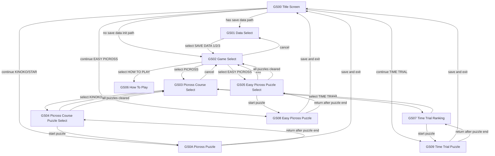
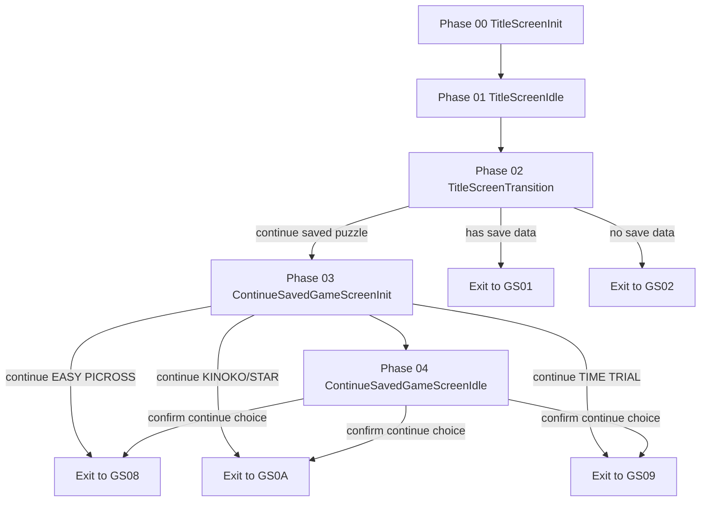
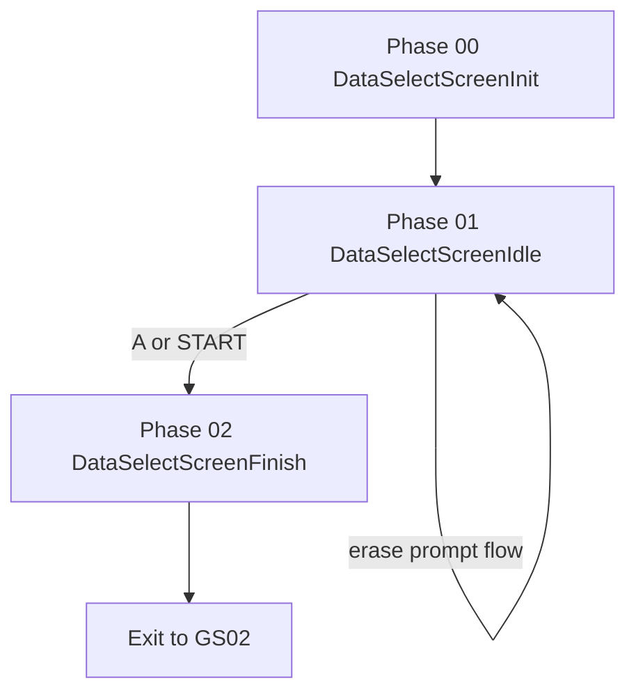
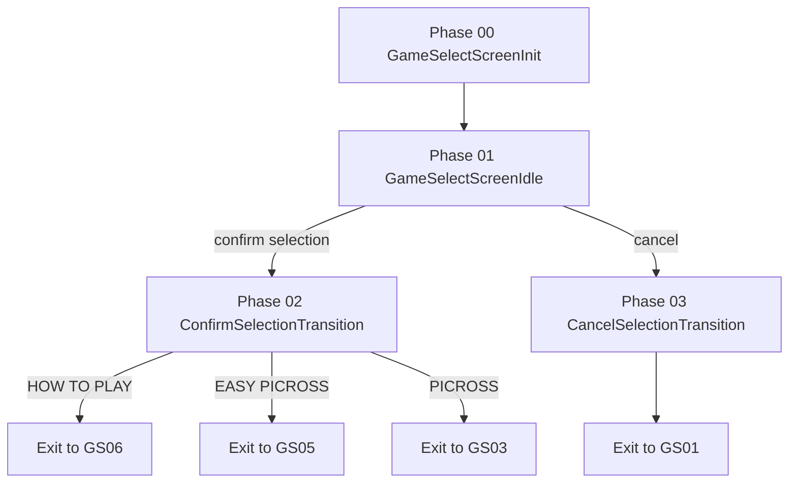
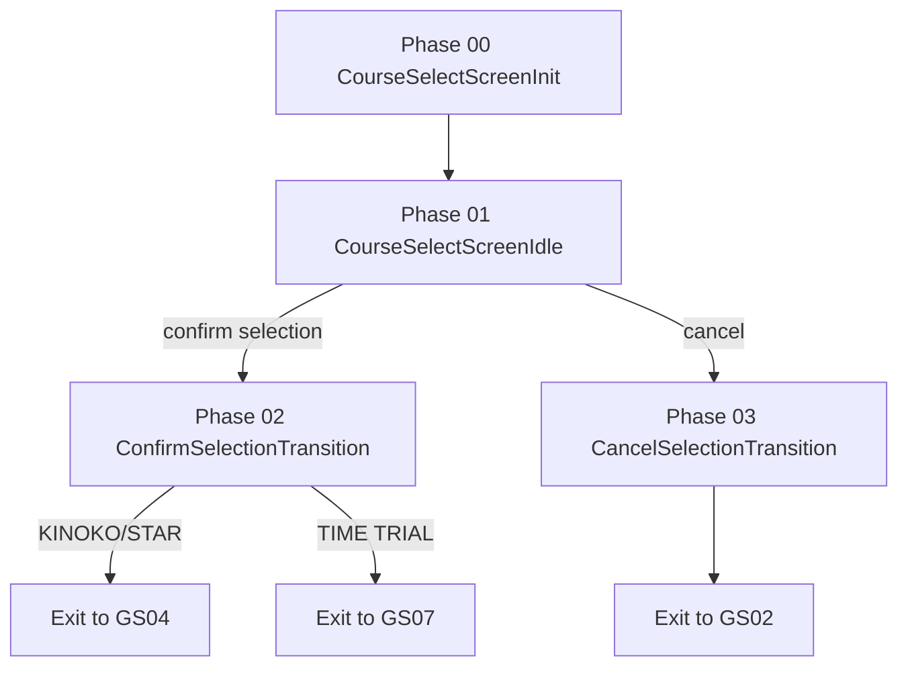
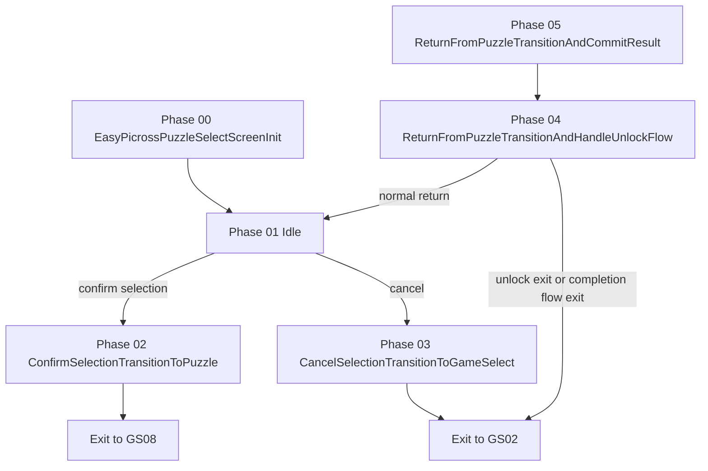
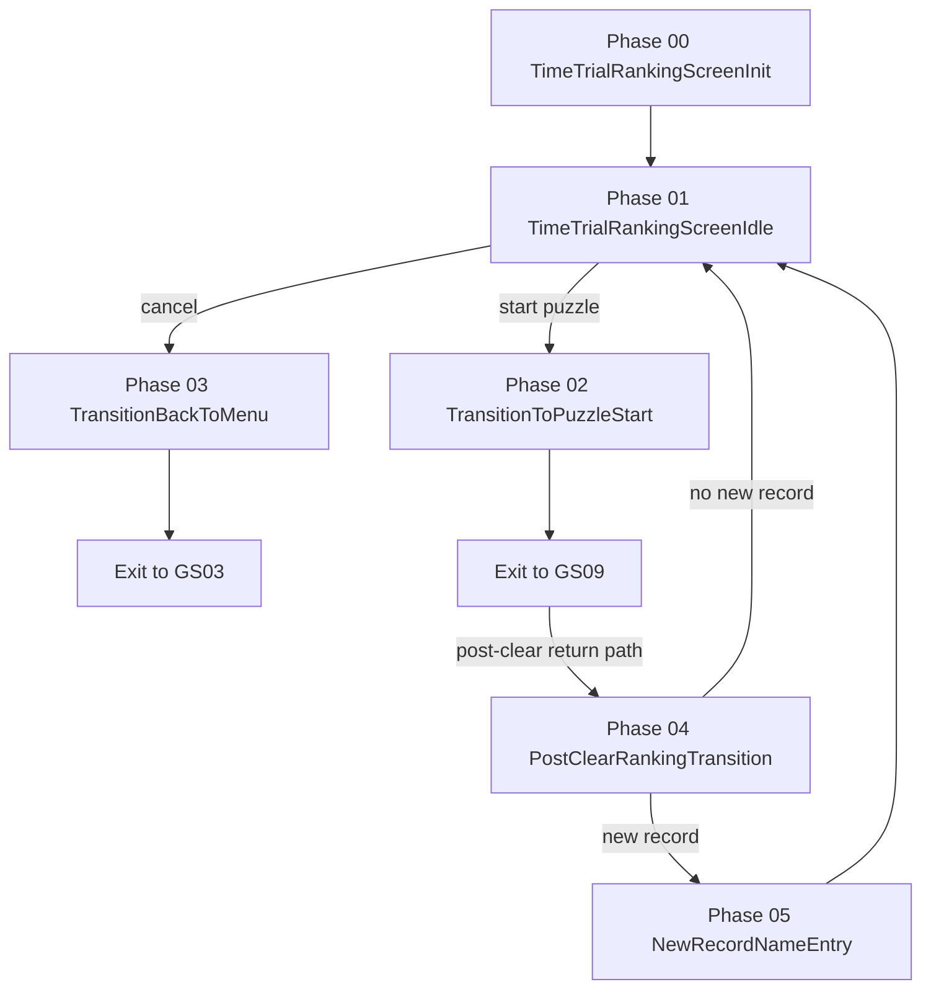
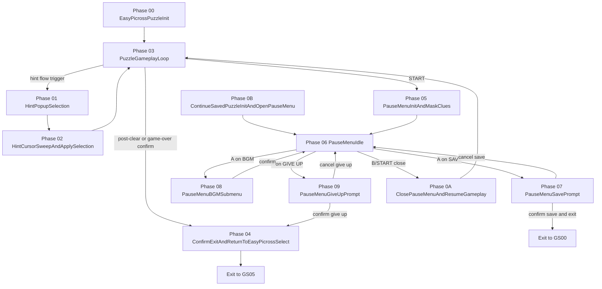

# Mario's Picross GB Disassembly: Game Flow Reference

Based on currently mapped symbols in `Mario's Picross (USA, Europe) (SGB Enhanced).sym` and `disassembly/bank_00[1-f].asm`. Only mapped symbols and directly observed control flow are included.

## 1) Main Game Loop & Interrupts

### VBlank interrupt

## 2) State Flow

The game is driven by a state machine centered on the main game-state byte, with state handlers dispatched from the startup/runtime entry points and phase-specific routines reached from within each state. The flow starts from the title and selection screens, moves into gameplay, and then branches into result/end-game paths depending on the mode and outcome. The available evidence supports a layered structure of broad states plus smaller phase steps, rather than a single monolithic loop.

### GameState Flow

### Phase Flows

#### GS00 Phase Flow

#### GS01 Phase Flow

#### GS02 Phase Flow

#### GS03 Phase Flow

#### GS04 Phase Flow

#### GS05 Phase Flow

#### GS06 Phase Flow

```mermaid
flowchart TD
	GS06P00[00 Init] --> GS06P01[01 Message]
	GS06P01 --> GS06P02[02 HighlightNumbersTop Prepare]
	GS06P02 --> GS06P03[03 HighlightNumbersTop Animation]
	GS06P03 --> GS06P04[04 HighlightNumbersLeft Prepare]
	GS06P04 --> GS06P05[05 HighlightNumbersLeft Animation]
	GS06P05 --> GS06P06[06 Message]
	GS06P06 --> GS06P07[07 Message]
	GS06P07 --> GS06P08[08 SolvePuzzle Prepare]
	GS06P08 --> GS06P09[09 SolvePuzzle Animation]
	GS06P09 --> GS06P0A[0A SolvePuzzle Finish]
	GS06P0A --> GS06P0B[0B Message]
	GS06P0B --> GS06P0C[0C ResetBoard]
	GS06P0C --> GS06P0D[0D HighlightNumbersTop Prepare]
	GS06P0D --> GS06P0E[0E HighlightNumbersTop Animation]
	GS06P0E --> GS06P0F[0F Message]
	GS06P0F --> GS06P10[10 HighlightNumbersFirstColumn Prepare]
	GS06P10 --> GS06P11[11 HighlightNumbersFirstColumn Animation]
	GS06P11 --> GS06P12[12 SolveFirstColumn Prepare]
	GS06P12 --> GS06P13[13 SolveFirstColumn Animation]
	GS06P13 --> GS06P14[14 HighlightNumbersLeft Prepare]
	GS06P14 --> GS06P15[15 HighlightNumbersLeft Animation]
	GS06P15 --> GS06P16[16 Message]
	GS06P16 --> GS06P17[17 HighlightNumbersSecondRow Prepare]
	GS06P17 --> GS06P18[18 HighlightNumbersSecondRow Animation]
	GS06P18 --> GS06P19[19 SolveSecondRow Prepare]
	GS06P19 --> GS06P1A[1A SolveSecondRow Animation]
	GS06P1A --> GS06P1B[1B Message]
	GS06P1B --> GS06P1C[1C DecrementPuzzleTimer]
	GS06P1C --> GS06P1D[1D GameOverMessage]
	GS06P1D --> GS06P1E[1E MakeMistake Prepare]
	GS06P1E --> GS06P1F[1F MakeMistake Animation]
	GS06P1F --> GS06P20[20 Message]
	GS06P20 --> GS06P21[21 MarkWithX Prepare]
	GS06P21 --> GS06P22[22 MarkWithX Animation]
	GS06P22 --> GS06P23[23 WithHintPopUp Prepare]
	GS06P23 --> GS06P24[24 WithHintPopUp Demonstration]
	GS06P24 --> GS06P25[25 Message]
	GS06P25 --> GS06P26[26 StopTopHintCursor]
	GS06P26 --> GS06P27[27 StopLeftHintCursor]
	GS06P27 --> GS06P28[28 ApplyHintSolve]
	GS06P28 --> GS06P29[29 AdvanceOrRestart]
	GS06P29 -->|restart path| GS06P00
	GS06P29 -->|cancel path| GS06P2A[2A CancelAndReturnToMenu]
```

#### GS07 Phase Flow

#### GS08 Phase Flow

## 3) Graphics & Sprite Rendering System

## 4) Sound Engine (Bank ???)

## 5) Save-Slot RAM Region Structure

The save-related region is centered in the `00:a000`-`00:ba07` address space and is split into a primary block plus a mirrored copy with checksums.

| Address / Range | Size | Key symbols | Purpose |
|---|---:|---|---|
| 00:a000 | 1 | rSaveDataPrimaryBlockStart | Start of primary save-data block. |
| 00:a001-00:a002 | 2 | rPuzzleOrderTableCursor, rPuzzleOrderTableStart | Puzzle-order table metadata. |
| 00:a003-00:a03e | 0x3c | TODO | Unmapped bytes in primary save block (TODO). |
| 00:a03f | 1 | rSaveDataTimeTrialRankingEntriesInsertAddressBias | Bias/base byte used by GS07 name-entry commit math when targeting ranking entries. |
| 00:a042-00:a064 | 0x23 | rSaveDataTimeTrialRankingEntries, rSaveDataTimeTrialRankingEntriesShiftSourceEnd, rSaveDataTimeTrialRankingEntriesShiftDestEnd | Time Trial ranking table in save data (5 entries x 7 bytes: MMSS + 3-char name), plus helper endpoints used by ranking-entry shifting. |
| 00:a065 | 1 | rSelectedSaveSlotIndex | Active save-slot index used by GS01/GS04/GS05 logic. |
| 00:a066-00:a068 | 3 | TODO | Unmapped bytes in primary save block (TODO). |
| 00:a069-00:a077 | 0x0f | rSaveSlotXEasyPicrossBGMSelectionIndex, rSaveSlotXPicrossKinokoBGMSelectionIndex, rSaveSlotXPicrossStarBGMSelectionIndex, rSaveSlotXTimeTrialBGMSelectionIndex, rSaveSlotXModeBGMSelectionIndexEntry4_Unknown | Per-slot BGM selection index entries (5 bytes per save slot: Easy Picross, Picross Kinoko, Picross Star, Time Trial, unknown entry4). |
| 00:a078-00:a07a | 3 | rSaveSlotXGameSelectCursorRow | Per-slot game-select cursor row. |
| 00:a07b-00:a07d | 3 | rSaveSlotXEasyPicrossPostClearUnlockFlowState_Unsure | Per-slot Easy Picross post-clear unlock-flow state bytes (observed in GS05). |
| 00:a07e-00:a080 | 3 | rSaveSlotXEasyPicrossClearedPuzzleCount | Per-slot Easy Picross cleared-count values. |
| 00:a081-00:a086 | 6 | rSaveSlotXEasyPicrossPuzzleSelectCursorColumn/Row | Per-slot Easy Picross puzzle-select cursor positions. |
| 00:a087-00:a386 | 0x300 | rSaveSlotXEasyPicrossPuzzleTimeDataRecordTable | Easy Picross per-slot time records (3 slots, each 64 entries x 3 bytes). |
| 00:a387-00:a389 | 3 | rSaveSlotXUnlockProgressState | Per-slot unlock progression state (`$01/$02/$03` observed). |
| 00:a38a-00:a38c | 3 | rSaveSlotXPicrossKinokoStarClearedPuzzleCount | Per-slot shared cleared-count used for GS04 unlock checks. |
| 00:a38d-00:a38f | 3 | rSaveSlotXCourseSelectCursorRow | Per-slot GS04 course-select row. |
| 00:a390-00:a3a1 | 0x12 | rSaveSlotXPicross{Kinoko,Star,TimeTrial_Unsure}CoursePuzzleSelectCursorColumn/Row | Per-slot + per-course GS04 cursor caches (Kinoko, Star, TimeTrial_Unsure). |
| 00:a3a2-00:aa61 | 0x6c0 | rSaveSlotXPicross{Course}PuzzleTimeDataRecordTable | GS04 time tables (3 slots x 3 course rows x 64 entries x 3 bytes). |
| 00:aa62-00:aca1 | 0x240 | rSaveSlotXPicross{Course}PuzzleStatusDataTable | GS04 status tables (3 slots x 3 course rows x 64 entries x 1 byte). |
| 00:aca2 | 1 | rContinueSavedGameFlowMode_Unsure | Continue/load flow mode byte (behavior still uncertain). |
| 00:aca3-00:acea | 0x48 | rSavedPuzzleHintPopupSelection, rSavedPuzzleTimerAdjustmentStep, rSavedPuzzleTimerMinuteOnes, rSavedPuzzleTimerMinuteTens, rSavedPuzzleTimerSecondOnes, rSavedPuzzleTimerSecondTens, rSavedPuzzleDataIndexLow, rSavedPuzzleDataIndexHigh, rSavedPuzzleCursorColumn, rSavedPuzzleCursorRow, rSavedPuzzleCellStatePackedBuffer, rSavedPuzzleGridWidth, rSavedPuzzleGridHeight | Saved puzzle snapshot fields used by continue/restore flow (timer, puzzle id, cursor, packed cell-state buffer, grid dimensions). |
| 00:aceb-00:acec | 2 | TODO | Unmapped bytes in primary save block (TODO). |
| 00:aced | 1 | rHiddenProgrammerCreditsMirror | Mirror byte tied to signature validation data. |
| 00:acee-00:acfc | 0x0f | TODO | Unmapped bytes in primary save block (TODO). |
| 00:acfd | 1 | rSaveValidationMagicBytesMirror | Mirror of save-validation magic data. |
| 00:acfe-00:ad01 | 4 | TODO | Unmapped bytes in primary save block (TODO). |
| 00:ad02-00:ad03 | 2 | rSaveDataPrimaryChecksumSum, rSaveDataPrimaryChecksumXor | Checksums for primary save block. |
| 00:ad04-00:ba05 | 0x0d02 | rSaveDataMirrorBlockStart | Mirror copy of save-data block. |
| 00:ba06-00:ba07 | 2 | rSaveDataMirrorChecksumSum, rSaveDataMirrorChecksumXor | Checksums for mirror save block. |

Notes:
- `rSaveSlotX...` denotes the slot-specific variants (slot 1/2/3 labels) already mapped in the symbol file.
- `Picross{Course}` denotes the Kinoko/Star/TimeTrial_Unsure variants.

## 6) Unused / Cut Content
